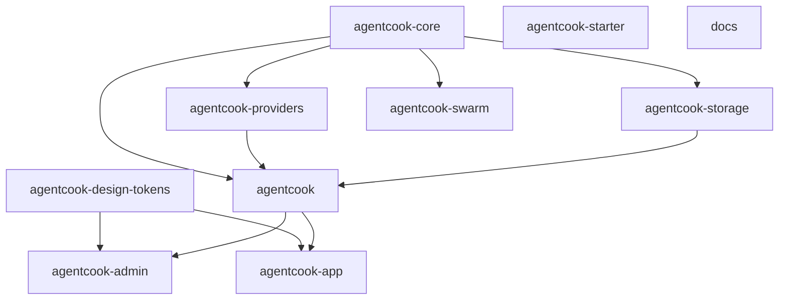
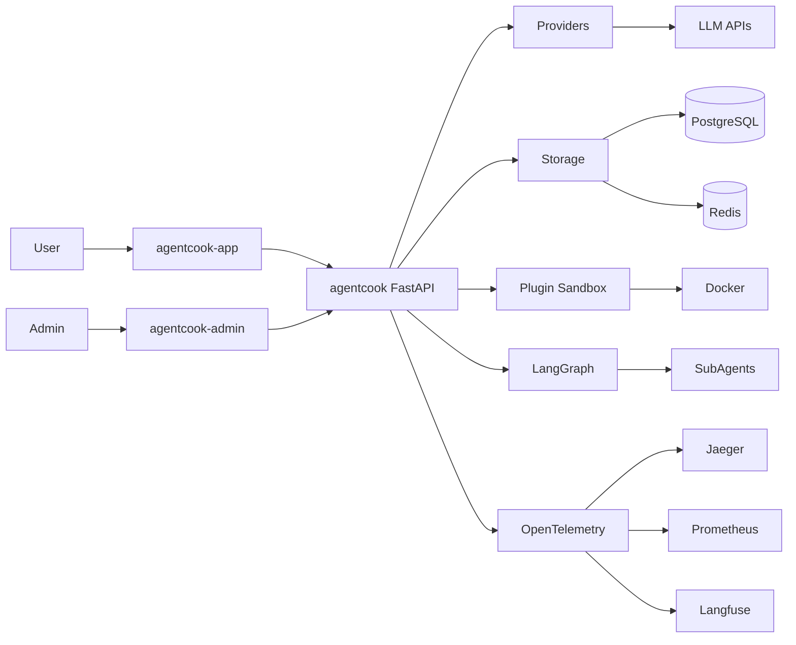

# agentcook Architecture

agentcook 是一个商业级 AI Agent 产品的完整技术栈。

## 1. 仓库矩阵



**依赖关系说明：**
- `agentcook-core` 被 providers、storage、agentcook、swarm 依赖
- `agentcook` 依赖 core + providers + storage
- `design-tokens` 被 admin 和 app 依赖
- admin 和 app 通过 API 调用 agentcook
- starter 和 docs 独立

## 2. 数据流



**核心链路：**
- User → app → agentcook(FastAPI) → 分支到 providers(→LLM)、storage(→DB/Redis)、Plugin Sandbox(→Docker)、LangGraph(→SubAgents)
- Admin → admin UI → agentcook
- agentcook → OpenTelemetry → Jaeger/Prometheus/Langfuse

## 3. 测试金字塔

```
        /\
       /E2E\      Playwright (5核心流程)
      /------\
     /Contract\   Pact (服务间API 100%)
    /----------\
   /Integration\  pytest+testcontainers (关键路径100%)
  /--------------\
 /    Unit        \ pytest/vitest (≥80%)
/------------------\
```

**4 层测试策略：**
1. **Unit**: pytest/vitest，覆盖率 ≥80%
2. **Integration**: pytest + testcontainers，关键路径 100%
3. **Contract**: Pact (pact-python + pact-js)，服务间 API 100%
4. **E2E**: Playwright，5 个核心用户流程
