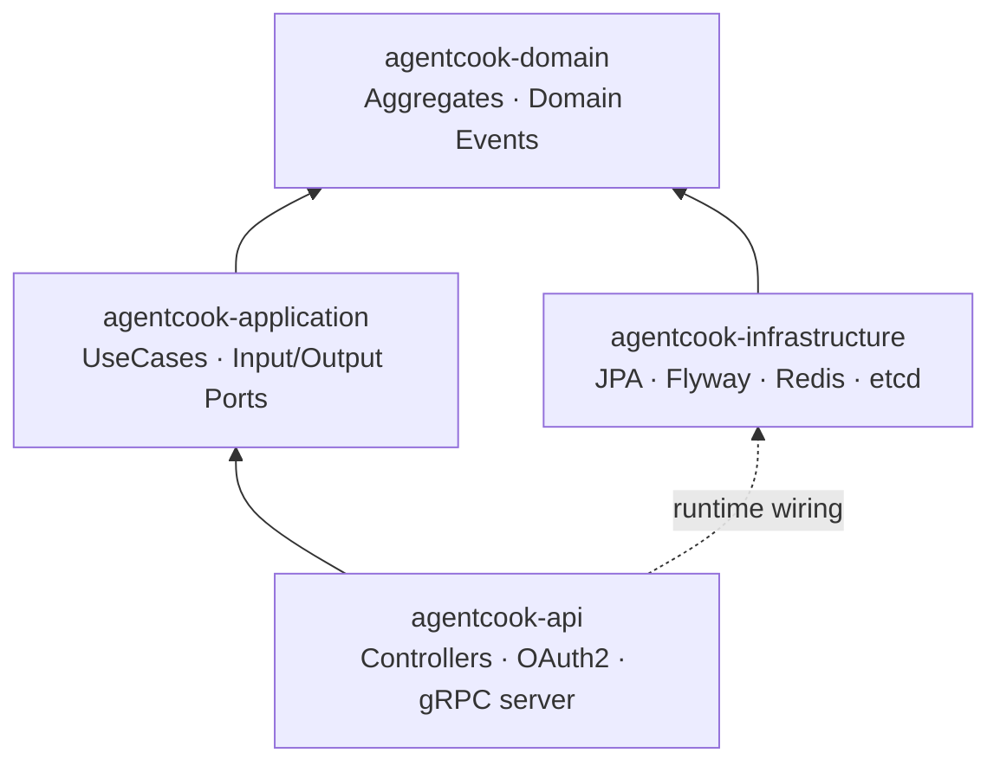

# agentcook-java

Spring Boot 3 business backend for agentcook (ADR-013). Owns the User /
Session / Plugin / Connector / Permission aggregates, plus the OAuth2
Resource Server in front of them. The Python runtime (`agentcook` +
`agentcook-core` + `agentcook-storage`) owns Memory / Soul / Identity
/ multi-agent orchestration; this module never talks to LLMs.

## Architecture

```
┌────────────────────────────────────────────────────────────────┐
│  agentcook-api          (Spring MVC controllers, DTOs,         │
│   ↑↑                     Spring Security OAuth2, gRPC server)  │
│   ↑                                                            │
│  agentcook-application  (UseCase + Input/Output Ports,         │
│   ↑                      Transaction boundary, Spring          │
│   ↑                      @Service beans)                       │
│   ↑                                                            │
│  agentcook-domain       (Aggregates, Value Objects, Domain     │
│   ↑                      Events, Repository ports — pure Java, │
│   ↑                      no Spring)                            │
│   ↑                                                            │
│  agentcook-infrastructure (JPA + Flyway + Redis + etcd,        │
│                            Repository adapters)                │
└────────────────────────────────────────────────────────────────┘
```

DDD four-layer, hexagonal dependency direction: every arrow points
**up** from infra towards domain. Domain is pure Java (no Spring, no
JPA); application depends on domain; infrastructure implements the
domain Repository ports.



## Modules

| Module | What lives here | What never lives here |
|---|---|---|
| `agentcook-domain` | Aggregates (User / Session / Plugin / Connector / Permission), Value Objects (`UserId`, `SessionId`, …), Domain Events, Repository interfaces | Spring, JPA, anything that talks to the wire |
| `agentcook-application` | UseCase implementations (`@Service @Transactional`), Input Ports (UseCase interfaces + Command/Query records), application-level Exceptions | HTTP / DB / gRPC / cache wiring |
| `agentcook-infrastructure` | JPA Entities + Spring Data Repositories, Repository adapters (implement Domain Ports), Flyway migrations, Redis cache config, etcd service registry | Controllers, DTOs |
| `agentcook-api` | `@RestController` + DTO records, OpenAPI (springdoc), Spring Security OAuth2 Resource Server, gRPC server (SSE → gRPC bridge), Observability filters, the `@SpringBootApplication` main class | Domain logic |

## Local development

### Prerequisites

- JDK 17 (eclipse-temurin recommended)
- Maven 3.9+ (the project ships `mvnw` if you prefer the wrapper)
- Docker (for Testcontainers — postgres:16-alpine pulled on first test run)

### Build + test

```bash
# Full build, all tests
mvn clean install

# Just one module
mvn -pl agentcook-domain test
mvn -pl agentcook-api test

# Skip Testcontainers-backed integration tests (faster, no Docker needed)
mvn -pl agentcook-domain,agentcook-application test
```

Testcontainers needs `DOCKER_HOST` pointing at your daemon — colima
users:

```bash
export DOCKER_HOST=unix:///Users/$USER/.colima/default/docker.sock
export TESTCONTAINERS_RYUK_DISABLED=true
```

### Run locally

```bash
# Option A: IDEA / mvn spring-boot:run
# default profile expects postgres-business on host port 5433 + redis on 6379
docker compose -f ../docker-compose.dev.yml up -d postgres-business redis
mvn -pl agentcook-api spring-boot:run

# Option B: docker (uses the docker profile, in-container hostnames)
docker compose -f ../docker-compose.dev.yml up -d agentcook-java
```

### Hit the API

- Swagger UI: <http://localhost:8080/swagger-ui.html>
- OpenAPI spec: <http://localhost:8080/v3/api-docs.yaml>
- Login (returns a JWT — paste into Swagger UI "Authorize"):
  ```bash
  curl -sS -X POST http://localhost:8080/api/v1/auth/login \
      -H 'Content-Type: application/json' \
      -d '{"username":"alice","password":"dev"}'
  ```
- Health probes: `/actuator/health/liveness` + `/actuator/health/readiness`
- Prometheus scrape: `/actuator/prometheus`

## Deployment

### Docker

```bash
# Build (uses the included Dockerfile — multi-stage, non-root, healthcheck)
docker build -t agentcook-java:latest .

# Run standalone (postgres / redis must be reachable; see env vars below)
docker run --rm -p 8080:8080 -p 9090:9090 \
    -e POSTGRES_HOST=host.docker.internal -e POSTGRES_PORT=5433 \
    -e REDIS_HOST=host.docker.internal \
    -e AGENTCOOK_AUTH_JWT_SECRET="$(openssl rand -base64 48)" \
    agentcook-java:latest
```

### Kubernetes

Activate the `k8s` profile so the app uses K8s in-cluster DNS for
Postgres / Redis / agent-core and disables etcd registration:

```yaml
env:
  - name: SPRING_PROFILES_ACTIVE
    value: k8s
```

Probes:

```yaml
livenessProbe:
  httpGet: { path: /actuator/health/liveness, port: 8080 }
readinessProbe:
  httpGet: { path: /actuator/health/readiness, port: 8080 }
```

Full config / Secret split: see [`docs/k8s-config-mapping.md`](../docs/k8s-config-mapping.md).

## API surface

15+ REST operations, generated live from `@RestController` annotations:

| Resource | Endpoints |
|---|---|
| Auth | `POST /api/v1/auth/login` (public, returns JWT) |
| Users | `GET/POST /api/v1/users`, `GET /api/v1/users/{id}` |
| Permissions | `GET/POST /api/v1/users/{userId}/permissions`, `DELETE /api/v1/permissions/{id}` |
| Sessions | `GET/POST /api/v1/sessions`, `GET /api/v1/sessions/{id}` |
| Plugins | `GET/POST /api/v1/plugins`, `POST /api/v1/plugins/{id}/activate` |
| Connectors | full CRUD + `POST /api/v1/connectors/{id}/ping` + OAuth callback |

Frozen spec: `../docs/api/java-v1.yaml`. Versioning policy:
[`../docs/api/DEPRECATION-POLICY.md`](../docs/api/DEPRECATION-POLICY.md).

## gRPC

The api module exposes a gRPC server on port 9090 (see
`grpc/GrpcServerConfig.java`). `ChatService` bridges SSE chat into
unary streaming so the Python runtime can call back over gRPC.

```bash
grpcurl -plaintext localhost:9090 list   # requires Reflection enabled
```

## What's in each directory

```
agentcook-java/
├── pom.xml                   # parent — versions for grpc, protobuf, jetcd, jjwt
├── Dockerfile                # multi-stage; K8s-aware JVM defaults (Day 41)
├── proto/                    # checked-in protobuf (../../../proto/)
├── agentcook-domain/         # pure Java domain
├── agentcook-application/    # @Service UseCases
├── agentcook-infrastructure/ # JPA + Flyway + Redis + etcd
└── agentcook-api/            # @RestController + OAuth2 + gRPC + Spring Boot main
```

## Related docs

- [`docs/ddd-guide.md`](./docs/ddd-guide.md) — DDD four-layer
  walk-through with the five aggregates as worked examples
- [`../docs/api/CHANGELOG.md`](../docs/api/CHANGELOG.md) — spec version history
- [`../docs/api/VERSIONING-POLICY.md`](../docs/api/VERSIONING-POLICY.md) — when / how to bump
- [`../docs/api/DEPRECATION-POLICY.md`](../docs/api/DEPRECATION-POLICY.md) — sunset rules + decision tree
- [`../docs/k8s-config-mapping.md`](../docs/k8s-config-mapping.md) — ConfigMap / Secret layout
- [`../docs/adr/ADR-013-java-business-backend.md`](../docs/adr/ADR-013-java-business-backend.md) — why Java + DDD
- [`CHANGELOG.md`](./CHANGELOG.md) — module-level change log

## 教程深度参考

This module is the running example for **教程第 03 讲 — 从用户故事到
DDD 四层架构** (`agentcook/tutorial/chapters/03-from-user-story-to-architecture.md`).
The chapter walks readers through:

1. **From a 5-line user story to five aggregates** — how
   `User` / `Session` / `Plugin` / `Connector` / `Permission` fall
   out of "an end user activates a plugin to talk to a model" without
   forcing the aggregates upfront. The mental model lives in §3 of the
   chapter; the code lives in [`agentcook-domain/src/main/java/cc/agentcook/domain/`](agentcook-domain/src/main/java/cc/agentcook/domain/).
2. **Why the dependency arrows all point up** — the chapter contrasts
   this module's structure with a "service-oriented anemic domain"
   shape, using the same five aggregates implemented both ways. The
   layered-vs-anemic comparison sits in §5.
3. **The hexagonal seam in practice** — the chapter uses
   `PluginActivationService` (`agentcook-domain/src/main/java/cc/agentcook/domain/service/PluginActivationService.java`)
   as the worked example of a domain service that needs zero
   infrastructure to test. The matching unit test
   (`agentcook-domain/src/test/.../PluginActivationServiceTest.java`)
   is the first thing a reader runs.
4. **Where infra/wiring lives** — the chapter's §7 (infrastructure
   adapters) references this module's `agentcook-infrastructure`
   package directly. Readers can `cmd-click` from the chapter into
   the JPA adapter implementations.

If you're reading the source first and the chapter second, the
mapping below tells you which file to open for each chapter section:

| Chapter section | Files in this module |
|---|---|
| §3 user story → 5 aggregates | `agentcook-domain/src/main/java/cc/agentcook/domain/{user,session,plugin,connector,permission}/` |
| §4 value objects vs entities | `agentcook-domain/.../UserId.java`, `SessionId.java`, etc. (all `*Id.java` files) |
| §5 layered vs anemic | full layered impl: this module; anemic counter-example is in the chapter inline |
| §6 domain services | `agentcook-domain/.../service/PluginActivationService.java` |
| §7 infrastructure adapters | `agentcook-infrastructure/src/main/java/cc/agentcook/infrastructure/persistence/adapter/` |
| §8 application boundary | `agentcook-application/src/main/java/cc/agentcook/application/usecase/` |
| §9 API layer | `agentcook-api/src/main/java/cc/agentcook/api/controller/` |
| §10 testing the seams | `agentcook-{domain,application,api}/src/test/` (see also `docs/ddd-guide.md` for the testing-pyramid mapping) |
