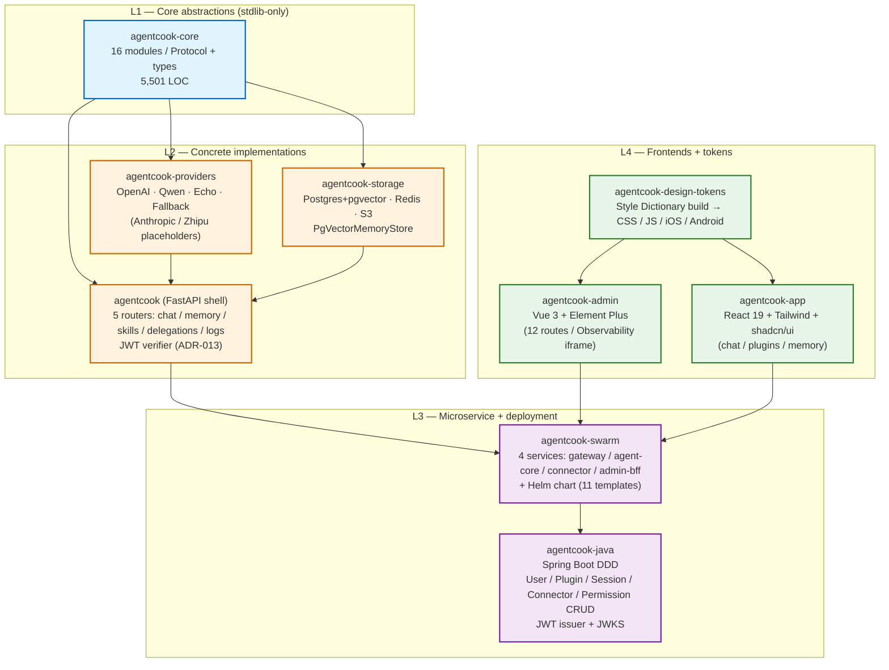

# 01 — Overall Architecture

Top-down view of the `agentcook-cc` monorepo at the end of Phase 5
(Day 52). Three concentric layers:

1. **Core abstractions** — `agentcook-core` defines protocols + types only.
2. **Concrete implementations** — providers / storage / shell + microservices.
3. **Frontends + companion repos** — Vue admin + React app + Java DDD backend + design-tokens.

## Layer Boundaries

### L1 → L2 — Protocol contracts

`agentcook-core` exports only `typing.Protocol` classes and frozen
dataclasses. Concrete implementations satisfy these protocols
structurally; there is no `abstract base class` to subclass.

Key contracts crossed from L1 to L2:

| Contract (L1) | Implementer (L2) |
|---------------|------------------|
| `LLMProviderProtocol` | `OpenAIProvider`, `FallbackProvider`, `EchoProvider` |
| `MemoryStore` (Protocol) | `PgVectorMemoryStore` (in `agentcook-storage`) |
| `SandboxExecutor` (Protocol) | `DockerSandboxExecutor` (in `agentcook-core.sandbox_runner` — defaults; alternates wire-in via `agentcook` shell) |
| `Tracer` / `Span` (Protocol) | `OTelTracerAdapter` (in `agentcook.observability` + `agentcook-swarm/services/agent-core/observability.py`) |
| `LangfuseHook` (Protocol) | `LangfuseAdapter` (in `agentcook-swarm/services/agent-core/langfuse_adapter.py`) |

### L2 → L3 — Service composition

`agentcook` (the FastAPI shell) is one process. `agentcook-swarm`
splits the same routers across containers (HTTP) and adds the
gRPC bridge to Java (ADR-014). Both deployments share the same
`agentcook-core` / `agentcook-providers` / `agentcook-storage`
codebase — the swarm services are *not* rewrites.

### L3 ↔ L3 — Dual backend (ADR-013)

`agentcook` Python = Agent runtime + Memory. `agentcook-java` Spring Boot
= User / Permission / Connector / Plugin CRUD + JWT issuer + JWKS.
They share no database tables (Python owns `agents` / `soul_versions` /
`memory_events`; Java owns the rest). Cross-language calls go through
gRPC (`ChatService.StreamChat`) and HTTP (`Authorization: Bearer`
headers verified by `agentcook_app.security`).

### L4 → L3 — Frontend wire format

Both frontends ship the wire format from `frontend-conventions.md §7`:
`Authorization: Bearer <token>` headers, SSE `data: {json}\n\n` frames,
versioned URL prefix `/api/v1`. `agentcook-design-tokens` is the only
package both admin and app depend on for visual consistency.

## Versioning Posture

| Layer | Versioning | Stability |
|-------|------------|-----------|
| L1 `agentcook-core` | SemVer (pre-1.0 pin exact MINOR) | 🟢 strict — Protocol shape changes need ADR |
| L2 packages | Track L1 `^N.x` | 🟢 strict |
| L3 swarm services | Container image tag = git SHA (or `phase-N-rcM`) | 🟡 best-effort |
| L4 frontends | Independent npm-style versioning (Vue admin + React app + tokens) | 🟡 best-effort |

See [`agentcook-core/README.md`](../../agentcook-core/README.md)
§Version Compatibility for the full strict-vs-best-effort matrix.

## What This Diagram Does Not Show

- Backing services (Postgres / Redis / etcd / Jaeger / Prometheus /
  Loki / Grafana / OTel Collector) — see
  [`agentcook-swarm/README.md`](../../agentcook-swarm/README.md) and
  [`02-chat-realtime-dataflow.md`](./02-chat-realtime-dataflow.md).
- Tutorial repository (`agentcook/tutorial/`) and `_internal/` artifacts.
- Build / publish tooling (`uv`, `pnpm`, Maven, `release-please`).

## Reading Order

For a new engineer onboarding to the codebase:

1. This file (`01-overall-architecture.md`) — the big picture.
2. [`02-chat-realtime-dataflow.md`](./02-chat-realtime-dataflow.md) —
   trace one request from the browser to Qwen and back.
3. [`03-k8s-deployment.md`](./03-k8s-deployment.md) — how the swarm
   lands in Kubernetes.
4. `agentcook-core/src/agentcook_core/protocols.py` — the Protocol
   shapes that hold the whole thing together.
