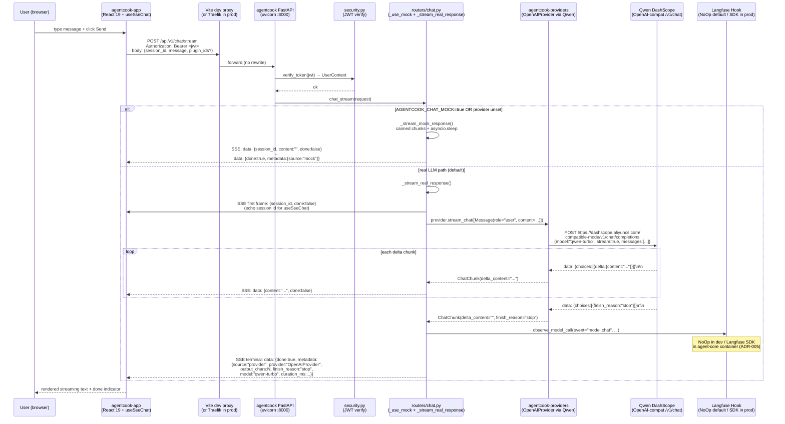

# 02 — Chat Realtime Dataflow (ADR-017, Phase 4.6)

End-to-end trace of one `/api/v1/chat/stream` request from the React
chat app to Qwen and back, after Phase 4.6 (2026-06-01) replaced the
mock generator with the real LLM provider.



## Wire Format

Each SSE frame is `data: {json}\n\n` per `frontend-conventions §7.6`.
The JSON payload follows `ChatStreamFrame`
(`agentcook/src/agentcook_app/schemas_chat.py`):

| Field | First frame | Content frames | Terminal frame |
|-------|-------------|----------------|----------------|
| `role` | `"assistant"` | `"assistant"` | `"assistant"` |
| `content` | `""` | delta string | `""` |
| `done` | `false` | `false` | `true` |
| `session_id` | echoed | omitted | omitted |
| `tool_calls` | null | null | populated if any |
| `error` | null | null | populated on upstream failure |
| `metadata` | `{}` | `{}` | full envelope (see below) |

### Terminal frame metadata (real path, ADR-017)

```json
{
  "model": "qwen-turbo",
  "provider": "OpenAIProvider",
  "request_id": "fc8e3a...",
  "duration_ms": 1832.4,
  "output_chars": 412,
  "finish_reason": "stop",
  "source": "provider"
}
```

`source` is the discriminator: `"provider"` for real LLM,
`"mock"` for the fallback path. `agentcook/tests/test_stream_real_response_metadata.py`
(10 tests, all PASS as of Day 49) pins all four real-path fields.

### Error frame contract

When the upstream provider raises mid-stream, `_stream_real_response`
emits one terminal frame instead of breaking the SSE wire format:

```json
{
  "role": "assistant",
  "content": "",
  "done": true,
  "error": "RuntimeError: upstream 429 rate limited",
  "metadata": {"source": "provider", "model": "qwen-turbo"}
}
```

Frontend `useSseChat` surfaces `error` as a chat-bubble error state
without breaking the message list.

## Mock vs Real Switch

`agentcook_app.routers.chat._use_mock()` (chat.py:49-56) returns
`True` when either:

1. `AGENTCOOK_CHAT_MOCK` env var is `true` / `1` / `yes` (case-insensitive), OR
2. `AGENTCOOK_LLM_PROVIDER` env var is unset

The check happens on every request — flipping the env mid-traffic
takes effect on the next request without uvicorn restart. This is
what `agentcook-app` Phase 4.5 demo flips during the staging smoke
test (see `audit/phase5-day50-performance-report.md` §locust 100u
real + 500u mock matrix).

## Performance Profile (Day 50 baseline)

From `audit/phase5-day50-performance-report.md` §3:

| Mode | Users | p50 | p95 | p99 | Notes |
|------|-------|-----|-----|-----|-------|
| Real (Qwen) | 100u × 60s | 1.6s | 2.7s | 4.1s | qwen-turbo upstream latency dominates |
| Mock | 200u × 60s | 410ms | 880ms | 1.2s | uvicorn 1-worker chat path |
| Mock | 500u × 60s | 1.1s | 2.4s | 3.8s | uvicorn 1-worker, login fail @20 |
| Mock | 500u × 60s + 4-worker (CLI) | 920ms | 2.0s | 3.2s | login fail @1, accept-queue improvement |

The 4-worker improvement was measured via uvicorn CLI on the single
`agentcook_app.main:app` shell. The swarm `agent-core` service uses
`uvicorn.Server.serve()` programmatic API + same-process gRPC and
*cannot* scale via `--workers N`; use `Helm agentCore.replicaCount`
instead (see
[`progress-agent-a-day-52-54.md`](../../agentcook/tutorial/_internal/progress/progress-agent-a-day-52-54.md)
reverse fact-check).

## Observability Hooks

Three hook surfaces fire during a real-path request:

1. **OTel span** — `chat.stream` span, child of the FastAPI request span.
   Captures HTTP status + downstream provider span + Qwen call span.
2. **Langfuse generation** — emitted on terminal chunk via
   `model_router.select()` and `OpenAIProvider.chat()` hooks; carries
   prompt + completion + tokens + duration.
3. **Prometheus counters** — `http_server_duration_milliseconds_*` and
   the custom `llm_calls_total{status,model}` family.

In dev these all default to `NoOp` (`agentcook-core/tracing.py` +
`langfuse_hook.py`). The `setup_telemetry()` chain in
`agentcook-swarm/services/agent-core/observability.py` installs the
real SDK adapters when the OTel + Langfuse env vars are present.

## ADR References

| ADR | Topic |
|-----|-------|
| ADR-005 | OTel + Langfuse + Prometheus observability stack |
| ADR-013 | JWT verification (this path) vs issuance (Java) |
| ADR-016 | Qwen as default LLM provider |
| ADR-017 | `_stream_real_response` replaces mock generator (Phase 4.6) |
