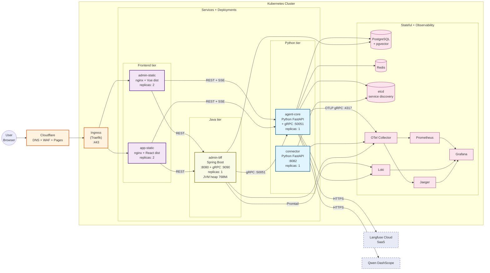

# 03 — Kubernetes Deployment (Helm chart, Phase 4)

The production deployment topology of `agentcook-cc` on Kubernetes,
fronted by Cloudflare DNS + Traefik Ingress. The Helm chart lives at
[`deploy/helm/agentcook/`](../../deploy/helm/agentcook) — 11 templates
managed by Agent C. This document describes the runtime shape;
C's [`docs/devops/`](../devops) is the operational reference.



## Helm Chart Layout

```
deploy/helm/agentcook/
├── Chart.yaml
├── values.yaml                     # default (dev / staging)
├── values-staging.yaml             # staging overrides
├── values-prod.yaml                # prod overrides (Phase 4.5 P2)
└── templates/
    ├── _helpers.tpl                # common labels / fullname
    ├── deployment-agent-core.yaml  # Python agent-core
    ├── deployment-connector.yaml   # Python connector
    ├── deployment-frontend.yaml    # admin-static + app-static
    ├── deployment-java.yaml        # admin-bff (D + C cross-cutting)
    ├── configmap.yaml              # env vars (non-secret)
    ├── secret.yaml                 # JWT + LLM API keys
    ├── service.yaml                # ClusterIP services for each
    ├── ingress.yaml                # Traefik routes
    ├── hpa.yaml                    # HorizontalPodAutoscaler
    └── pdb.yaml                    # PodDisruptionBudget
```

11 templates × default values render with `helm template` (no apply
needed) — see C's `docs/devops/k8s-operations-manual.md` for the
install + upgrade flow.

## Networking

| Edge | Path | Backend |
|------|------|---------|
| `agentcook.cc` | Cloudflare Pages | docs-site (VitePress, separate Pages project) |
| `staging.agentcook.cc` | K8s Ingress → staging namespace | full stack |
| `demo.agentcook.cc` | K8s Ingress → prod namespace (deferred to Phase 5+) | Blue-Green via Helm |
| `aquarium-writer-extending-thumbs.trycloudflare.com` | `cloudflared tunnel` → localhost:8000 | Phase 5 dev demo, not K8s |

Internal service-to-service stays inside the cluster:
`admin-bff` calls `agent-core` via gRPC at `agent-core:50051`, never
via the Ingress. etcd at `etcd:2379` handles dynamic discovery for
the swarm `agentcook_swarm/registry.py` lookups.

## Scaling

The Phase 4 chart sets `replicaCount: 1` on every Deployment. HPA
template is shipped but disabled by default. Day 50 performance work
proposed Helm-level scaling for `agent-core` to address the
single-worker uvicorn bottleneck:

> Use `agentCore.replicaCount: 1 → 4` (one worker per pod). Do **not**
> add `extraArgs: ["--workers", "4"]` — the swarm agent-core entrypoint
> uses `uvicorn.Server.serve()` programmatic API + same-process gRPC,
> which can't multiplex workers.

See `_internal/progress/progress-agent-a-day-52-54.md` reverse
fact-check section for the full reasoning + tradeoffs vs the
single-process `agentcook` shell that C measured locally.

## Stateful Dependencies

| Service | Persistence | Backup | Owner |
|---------|-------------|--------|-------|
| PostgreSQL + pgvector | PVC; managed PG in prod | nightly snapshot (cloud provider) | A (schema) + C (cluster) |
| Redis | optional persistence (AOF in prod) | not backed up (cache) | C |
| etcd | PVC | snapshot via `etcdctl snapshot save` | C |
| Loki (logs) | PVC; 7-day retention | not backed up | C |
| Prometheus | PVC; 14-day retention | not backed up | C |

Phase 5 backlog: Postgres backup automation runbook (currently relies
on cloud provider's default; needs explicit drill).

## Observability Flow

1. **Traces** — every Python service installs the OTel SDK on startup
   via `setup_telemetry()`; spans flow OTel Collector → Jaeger.
2. **Metrics** — `/metrics` endpoint on each service scraped by
   Prometheus; Grafana dashboards in `agentcook-swarm/grafana/`.
3. **Logs** — structlog JSON to stdout → Promtail tail → Loki →
   Grafana for query.
4. **LLM observability** — `agentcook_swarm/services/agent-core/
   langfuse_adapter.py` reports `generation` records to Langfuse
   Cloud via HTTPS; SaaS not in-cluster.

Required Helm `values.yaml` `observability:` block populates the
OTel + Langfuse env vars on every deployment template.

## Blue-Green Deployment (ADR-006)

`deploy/helm/agentcook/` supports two release labels (`blue` and
`green`) for cutover. The mechanics:

1. `helm install agentcook-prod-blue` (current live)
2. `helm install agentcook-prod-green` (new version)
3. Traefik Ingress weight shift: `0% → 50% → 100%` to green
4. `helm uninstall agentcook-prod-blue` after canary window

**Phase 4.5 deferred**: real production cutover is deferred to the
tutorial-publish window (P2 in roadmap). Phase 5 buffer time
includes re-running `audit/phase5-day50-performance-report.md`'s
4-tier baseline against the staging stack before the prod switch.

## ADR References

| ADR | Topic |
|-----|-------|
| ADR-005 | Observability stack (OTel + Prom + Loki + Jaeger + Grafana) |
| ADR-006 | Blue-Green deployment strategy |
| ADR-013 | Java owns business backend (`admin-bff` separate Deployment) |
| ADR-014 | gRPC bridge (`agent-core:50051` ← `admin-bff` calls) |

For operations procedures (`helm install` / `upgrade` / `rollback` /
troubleshooting), see [`../devops/`](../devops) — C's runbooks.
